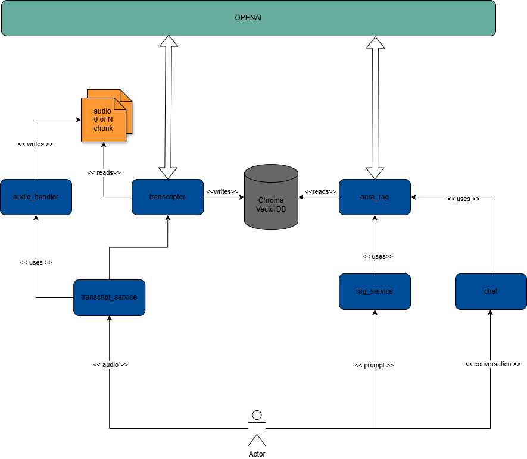

# Aura


## Overview


**Transcript Service:**
The module provides a resilient audio-processing pipeline that segments audio files into smaller chunks, transcribes each segment, and stores the resulting embeddings in a vector database. It includes built-in continuity safeguards: before creating new chunks, the system verifies whether corresponding embeddings already exist in the database, and it also detects previously generated chunks that were not successfully stored. These checks ensure that the pipeline can resume seamlessly after interruptions, avoiding redundant work and eliminating the need to restart the entire process.


**RAG Service:**
This module processes user prompts by performing a search over the vector database. It retrieves the most relevant embedded audio-transcription chunks and forwards this contextual information, together with the user’s query, to the OpenAI API. The model then generates a final response grounded in the retrieved data. This architecture ensures that outputs remain accurate, context-aware, and aligned with the content previously ingested into the system.


### Requirements
- Ubuntu 24.04.3
- Python 3.12.3
- Docker 8.0.1

### Setup
```bash
export OPENAI_API_KEY="your_key"
pip install -r requirements_prod.txt
sh setup.sh # <300 seconds.
```

After the setup you will be connected to a docker container from which you can run the services defined below.

### Transcription Service
```bash
python transcript/transcript_service.py -i inputs/BLACK_HOLES.mp3 -l DEBUG
```

### RAG Service
```bash
python rag/rag_service.py -i "is there a group project?"
# Output:
# Yes, there is a group project. The lectures covered topics such as 
# forming groups for an AI application project, building a project plan, 
# working with data, using existing AI tools, and the timeline for project
# milestones including presentations, peer reviews, mid-term interviews,
# and final submission. Give me more context.
```

```bash
python rag/chat.py
# SAMPLE OUTPUT:
# ===========================================================
# You: is there a group project?
# AuraRAG: Yes, there is a group project. The lectures covered topics including the
# formation and organization of groups, the objectives of building a generative AI
# application, project planning, data sourcing, implementation strategies, timelines,
# assessment criteria, and the use of existing AI tools. The project involves forming
# groups, creating a project plan, conducting peer reviews, participating in a mid-term
# interview, and submitting a final report. Give me more context.
# ===========================================================
```

